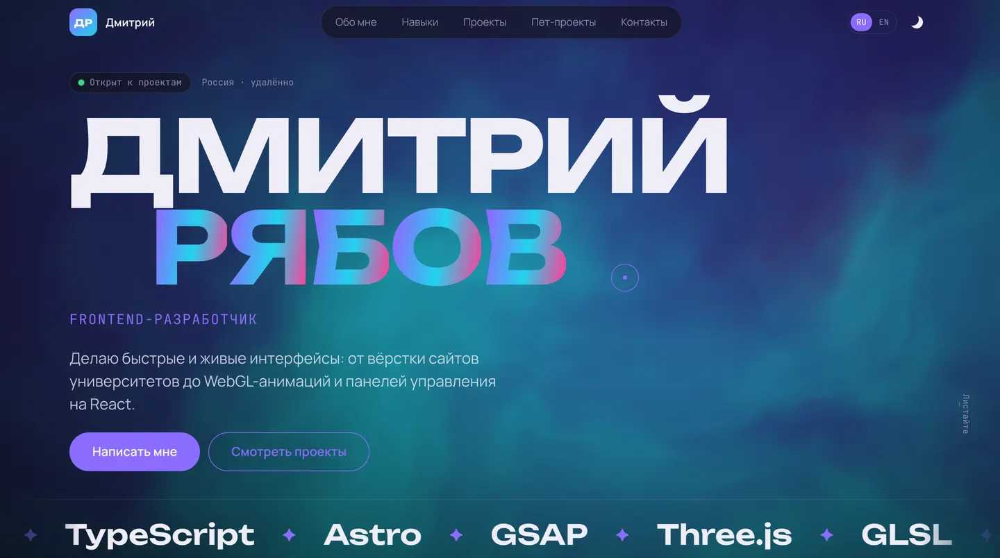
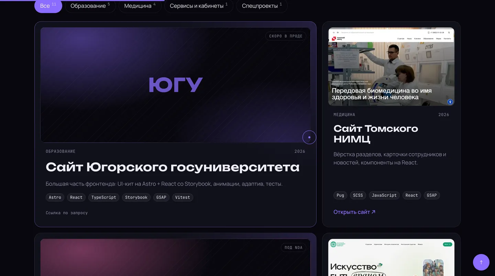
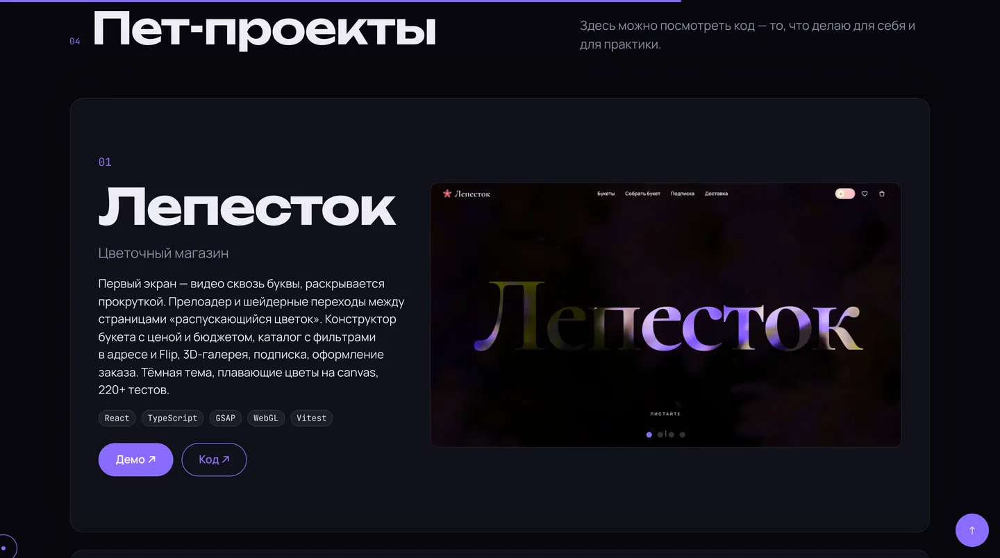

<div align="center">

<a href="https://dmitriy9427.github.io/resume/"></a>

# 👋 Сайт-резюме

**Дмитрий Рябов, frontend-разработчик — Astro, TypeScript, WebGL, два языка**

### [Открыть сайт →](https://dmitriy9427.github.io/resume/)

     [](https://github.com/dmitriy9427/resume/actions/workflows/pages.yml)

</div>

| Проекты | Пет-проекты |
| --- | --- |
|  |  |

## Коротко

| | |
| :---: | --- |
| 🌌 | **WebGL-сияние** — шейдер на первом экране тянется за курсором |
| 🗂 | **Проекты** — фильтр по категориям с Flip-анимацией, превью сайтов |
| 🌐 | **Два языка** — ru и en, hreflang, sitemap, Open Graph |
| 🌗 | **Тёмная и светлая темы** — без вспышки при загрузке |
| ✅ | **Качество** — 185 тестов, строгий TypeScript, доступность |

Автор — [Дмитрий Рябов](https://dmitriy9427.github.io/resume/), frontend-разработчик.

---

```bash
npm install
npm run dev        # http://localhost:4321
npm run check      # линтеры + типы + тесты + сборка — перед публикацией
npm run build      # готовый сайт в dist/
```

## Что где менять

**Почти всё — в одном файле: [`src/data/resume.ts`](src/data/resume.ts).** У каждого текста
два перевода `{ ru, en }`; если забыть один, TypeScript подсветит ошибку. Заглушки помечены `TODO`.

| Хочу поменять                                          | Где                                                 |
| ------------------------------------------------------ | --------------------------------------------------- |
| Имя, фамилию, должность, город, текст на первом экране | `profile` в `src/data/resume.ts`                    |
| Бейдж «Открыт к проектам»                              | `profile.available` (`false` — скрыть)              |
| Абзацы «Обо мне»                                       | `profile.about`                                     |
| Цифры (лет опыта, проектов, коммитов)                  | `stats`                                             |
| E-mail, Telegram, GitHub, hh.ru, PDF резюме            | `contacts` (пустой `href` — ссылка не показывается) |
| Навыки                                                 | `skills` (группы и списки)                          |
| Бегущая строка на первом экране                        | `marquee`                                           |
| Опыт работы                                            | `experience`                                        |
| Проекты в продакшне                                    | `projects` (см. ниже)                               |
| Категории фильтра проектов                             | `categories`                                        |
| Пет-проекты, их скриншоты и ссылки                     | `pets` + картинки в `public/projects/`              |
| Подписи кнопок и разделов («Навыки», «Открыть сайт»)   | `src/i18n/ui.ts`                                    |
| Цвета, шрифты                                          | `src/styles/_abstracts.scss`                        |
| Цвета «сияния» на первом экране                        | `--aurora-1/2/3` в `src/styles/sections/_hero.scss` |
| Порядок секций                                         | `src/components/ResumePage.astro`                   |
| Картинка для соцсетей                                  | `public/og.jpg` (1200×630)                          |
| Адрес сайта (для sitemap и ссылок)                     | `site` в `astro.config.mjs`                         |

### Добавить проект в продакшне

```ts
// src/data/resume.ts → projects
{
  title: { ru: 'Сайт клиники', en: 'Clinic website' },
  description: { ru: 'Что за сайт и что делал я', en: 'What it is and what I did' },
  category: 'med',            // ключ из categories
  year: '2026',
  stack: ['Astro', 'GSAP'],
  href: 'https://example.com', // пусто — «Ссылка по запросу» (проект под NDA)
  featured: true,              // карточка на две колонки (необязательно)
},
```

Под NDA пишите только тип сайта, стек и свою роль, без внутренних деталей. Название клиента
можно убрать, оставив описание («Сайт медицинского университета»).

### Добавить пет-проект

1. Скриншоты (лучше `.webp`, 1440×800 или около того) — в `public/projects/`.
2. Запись в `pets`: название, подзаголовок, описание, `images`, `stack`, `demo`, `repo`.
   Пустой `demo` — кнопка «Демо · Скоро».

### Первый экран

Имя всегда в одну строку, размер шрифта зависит от ширины экрана. Если длинная фамилия
не влезает, уменьшите `10vw` в `.hero__title` (`src/styles/sections/_hero.scss`).

## Как устроено

Учебные главы «что, как и почему» — в [docs/](docs/README.md):
[архитектура](docs/01-architecture.md) ·
[эффекты](docs/02-effects.md) ·
[деплой](docs/03-deploy.md) ·
[шпаргалка к собеседованию](docs/interview.md).

```
src/
├── data/resume.ts          ← содержимое резюме (меняется здесь)
├── i18n/ui.ts              ← подписи интерфейса на двух языках
├── components/             ← секции: Hero, About, Skills, Projects, Pets, Contact
├── layouts/Base.astro      ← <head> (SEO, hreflang, Open Graph), шапка, подвал
├── pages/index.astro       ← русская версия
├── pages/en/index.astro    ← английская версия
├── modules/                ← свои модули: aurora (WebGL-фон), spotlight (подсветка), copy-text
├── scripts/app.ts          ← запуск модулей
└── styles/                 ← стили: _abstracts (настройки), _layout, sections/*
```

Эффекты взяты из кита: появление при прокрутке, разбивка заголовков на буквы, «расшифровка»
текста, счётчики, бегущая строка, магнитные кнопки, Flip-фильтр проектов, карточки стопкой,
Swiper, свой курсор, плавный скролл. «Сияние» на первом экране — свой WebGL-шейдер
без библиотек (`src/modules/aurora`), он рисуется только пока виден.

Тема по умолчанию тёмная, светлая включается переключателем в шапке.

## Публикация

Сайт статический, `npm run build` кладёт его в `dist/`. Подходят Vercel, Netlify, GitHub Pages
(тогда `BASE_URL=/repo/ npm run build`) или любой хостинг статики. Перед публикацией поменяйте
`site` в `astro.config.mjs`. Подробно — `docs/deploy.md`.
